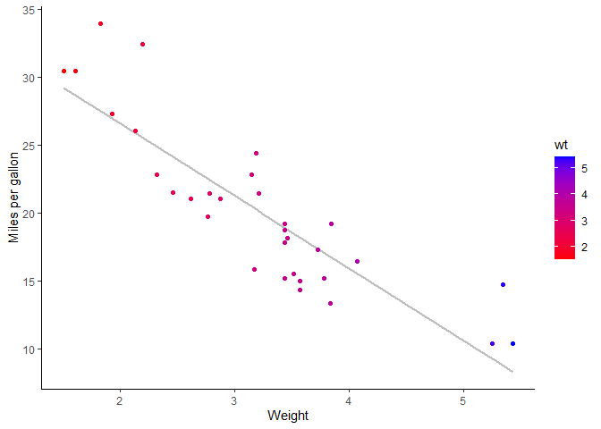
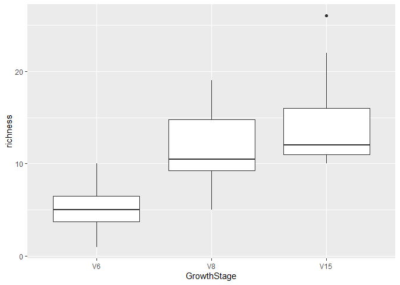
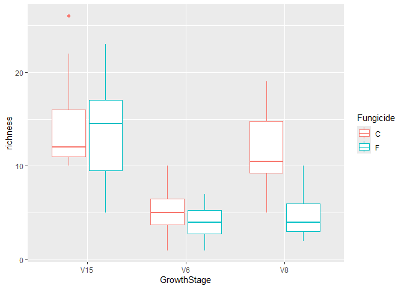

#Linear Models


``` r
#loading packages

library(tidyverse)
```

```
## Warning: package 'tidyverse' was built under R version 4.4.2
```

```
## Warning: package 'lubridate' was built under R version 4.4.2
```

```
## ── Attaching core tidyverse packages ──────────────────────── tidyverse 2.0.0 ──
## ✔ dplyr     1.1.4     ✔ readr     2.1.5
## ✔ forcats   1.0.0     ✔ stringr   1.5.1
## ✔ ggplot2   3.5.1     ✔ tibble    3.2.1
## ✔ lubridate 1.9.4     ✔ tidyr     1.3.1
## ✔ purrr     1.0.2     
## ── Conflicts ────────────────────────────────────────── tidyverse_conflicts() ──
## ✖ dplyr::filter() masks stats::filter()
## ✖ dplyr::lag()    masks stats::lag()
## ℹ Use the conflicted package (<http://conflicted.r-lib.org/>) to force all conflicts to become errors
```

``` r
library(lme4)
```

```
## Warning: package 'lme4' was built under R version 4.4.2
```

```
## Loading required package: Matrix
## 
## Attaching package: 'Matrix'
## 
## The following objects are masked from 'package:tidyr':
## 
##     expand, pack, unpack
```
Loading the data mtcars.

``` r
data("mtcars") #loading the database
```


``` r
library(ggplot2)
ggplot(mtcars, aes(x = wt, y = mpg)) +
  geom_smooth(method = lm, se = FALSE, color = "grey") +
  geom_point(aes(color = wt)) +
  xlab("Weight") + 
  ylab("Miles per gallon") +
  scale_colour_gradient(low = "red", high = "blue") +
  theme_classic()
```

```
## `geom_smooth()` using formula = 'y ~ x'
```

<!-- -->
Does it look like there is a relationship? Absolutely! But how do we know?

We run a linear model - or if it's a continuous x variable and a continuous y variable, we would call it a regression. If we consider it a cause-and-effect relationship, we may call it a correlation.

The simplest way to do this is with the function lm()


``` r
lm1 <- lm(mpg ~ wt, data = mtcars)
```

When we run this it gives us an output of the predicted Intercept or our β0 parameter.

We can now run summary of this linear model to output some summary statistics


``` r
summary(lm1)
```

```
## 
## Call:
## lm(formula = mpg ~ wt, data = mtcars)
## 
## Residuals:
##     Min      1Q  Median      3Q     Max 
## -4.5432 -2.3647 -0.1252  1.4096  6.8727 
## 
## Coefficients:
##             Estimate Std. Error t value Pr(>|t|)    
## (Intercept)  37.2851     1.8776  19.858  < 2e-16 ***
## wt           -5.3445     0.5591  -9.559 1.29e-10 ***
## ---
## Signif. codes:  0 '***' 0.001 '**' 0.01 '*' 0.05 '.' 0.1 ' ' 1
## 
## Residual standard error: 3.046 on 30 degrees of freedom
## Multiple R-squared:  0.7528,	Adjusted R-squared:  0.7446 
## F-statistic: 91.38 on 1 and 30 DF,  p-value: 1.294e-10
```
Now, we have a pretty good idea that the slope is not equal to 0, and the intercept estimate is pretty good.

Another thing to pay attention to is the R squared. This tells you the variation in y explained by x. So, in our case, about 74% of the variation in y is explained by the x variable.

Ok, what if we wanted an ANOVA table from this? We could run an ANOVA.

``` r
anova(lm1)
```

```
## Analysis of Variance Table
## 
## Response: mpg
##           Df Sum Sq Mean Sq F value    Pr(>F)    
## wt         1 847.73  847.73  91.375 1.294e-10 ***
## Residuals 30 278.32    9.28                      
## ---
## Signif. codes:  0 '***' 0.001 '**' 0.01 '*' 0.05 '.' 0.1 ' ' 1
```
Hey, the p-value is the same!!! Whoa… it means that a linear model and an ANOVA are essentially the same things, and the value reported in the ANOVA is the value of the linear regression or our slope parameter. This means that wt has a significant effect on miles per gallon.


We can also run correlation analysis

``` r
cor.test(mtcars$wt, mtcars$mpg)
```

```
## 
## 	Pearson's product-moment correlation
## 
## data:  mtcars$wt and mtcars$mpg
## t = -9.559, df = 30, p-value = 1.294e-10
## alternative hypothesis: true correlation is not equal to 0
## 95 percent confidence interval:
##  -0.9338264 -0.7440872
## sample estimates:
##        cor 
## -0.8676594
```

This gives us a different r value which is the correlation statistic. The closer to -1 or 1 means the stronger the correlation between the two variables.

The pvalue is the same in each of these analysis

#Catergorical variable
What if we have a categorial x variable and a continuous y variable we would perform a t-test.

Loading our example dataset

``` r
bull.rich <- read.csv("Sample_data/Bull_richness.csv")
```

Filter for one treatment and growth stage for t test.


``` r
bull.rich.sub <- bull.rich %>%
  filter(GrowthStage == "V8" & Treatment == "Conv.")

t.test(richness~Fungicide, data = bull.rich.sub)
```

```
## 
## 	Welch Two Sample t-test
## 
## data:  richness by Fungicide
## t = 4.8759, df = 17.166, p-value = 0.0001384
## alternative hypothesis: true difference in means between group C and group F is not equal to 0
## 95 percent confidence interval:
##   4.067909 10.265425
## sample estimates:
## mean in group C mean in group F 
##       11.750000        4.583333
```


##Doing this in linear model

``` r
lm2 <-lm(richness~Fungicide, data = bull.rich.sub)
summary(lm2)
```

```
## 
## Call:
## lm(formula = richness ~ Fungicide, data = bull.rich.sub)
## 
## Residuals:
##     Min      1Q  Median      3Q     Max 
## -6.7500 -1.7500 -0.6667  2.2500  7.2500 
## 
## Coefficients:
##             Estimate Std. Error t value Pr(>|t|)    
## (Intercept)   11.750      1.039  11.306 1.24e-10 ***
## FungicideF    -7.167      1.470  -4.876 7.12e-05 ***
## ---
## Signif. codes:  0 '***' 0.001 '**' 0.01 '*' 0.05 '.' 0.1 ' ' 1
## 
## Residual standard error: 3.6 on 22 degrees of freedom
## Multiple R-squared:  0.5194,	Adjusted R-squared:  0.4975 
## F-statistic: 23.77 on 1 and 22 DF,  p-value: 7.118e-05
```
ANOVA 

``` r
anova(lm2)
```

```
## Analysis of Variance Table
## 
## Response: richness
##           Df Sum Sq Mean Sq F value    Pr(>F)    
## Fungicide  1 308.17 308.167  23.774 7.118e-05 ***
## Residuals 22 285.17  12.962                      
## ---
## Signif. codes:  0 '***' 0.001 '**' 0.01 '*' 0.05 '.' 0.1 ' ' 1
```

What if we have more than two groups?


``` r
#Filter the data 

bull.rich.sub2 <- bull.rich %>%
  filter(Fungicide == "C" & Treatment == "Conv." & Crop == "Corn")

bull.rich.sub2$GrowthStage <- factor(bull.rich.sub2$GrowthStage, levels = c("V6", "V8", "V15")) # change the factor level

ggplot(bull.rich.sub2, aes(x = GrowthStage, y = richness)) +
  geom_boxplot()
```

<!-- -->

##linear model and various ANOVAs

``` r
lm.growth <- lm(richness ~ GrowthStage, data = bull.rich.sub2)
summary(lm.growth)
```

```
## 
## Call:
## lm(formula = richness ~ GrowthStage, data = bull.rich.sub2)
## 
## Residuals:
##    Min     1Q Median     3Q    Max 
## -6.750 -2.625 -1.000  2.250 11.583 
## 
## Coefficients:
##                Estimate Std. Error t value Pr(>|t|)    
## (Intercept)       5.250      1.208   4.348 0.000124 ***
## GrowthStageV8     6.500      1.708   3.806 0.000581 ***
## GrowthStageV15    9.167      1.708   5.368 6.23e-06 ***
## ---
## Signif. codes:  0 '***' 0.001 '**' 0.01 '*' 0.05 '.' 0.1 ' ' 1
## 
## Residual standard error: 4.183 on 33 degrees of freedom
## Multiple R-squared:  0.4803,	Adjusted R-squared:  0.4488 
## F-statistic: 15.25 on 2 and 33 DF,  p-value: 2.044e-05
```

``` r
anova(lm.growth)
```

```
## Analysis of Variance Table
## 
## Response: richness
##             Df Sum Sq Mean Sq F value    Pr(>F)    
## GrowthStage  2 533.56 266.778  15.247 2.044e-05 ***
## Residuals   33 577.42  17.497                      
## ---
## Signif. codes:  0 '***' 0.001 '**' 0.01 '*' 0.05 '.' 0.1 ' ' 1
```

##emmeans
Which group are different?
We can do post-hoc tests to find out. The simplest way to think of this is individual t-tests across groups. The most versatile way to do this is with the packages means, and multcomp.


``` r
library(emmeans)
```

```
## Welcome to emmeans.
## Caution: You lose important information if you filter this package's results.
## See '? untidy'
```

``` r
library(multcomp)
```

```
## Loading required package: mvtnorm
```

```
## Warning: package 'mvtnorm' was built under R version 4.4.2
```

```
## Loading required package: survival
```

```
## Loading required package: TH.data
```

```
## Warning: package 'TH.data' was built under R version 4.4.2
```

```
## Loading required package: MASS
```

```
## 
## Attaching package: 'MASS'
```

```
## The following object is masked from 'package:dplyr':
## 
##     select
```

```
## 
## Attaching package: 'TH.data'
```

```
## The following object is masked from 'package:MASS':
## 
##     geyser
```
The lsmeans are the least squared means - the means estimated by the linear model. This contrasts the arithmetic means, which are the means calculated or the average.

``` r
lsmeans <- emmeans(lm.growth, ~GrowthStage) # estimate lsmeans of variety within site and year
results_lsmeans <- cld(lsmeans, alpha = 0.05, details = TRUE) # contrast with Tukey ajustment by default. #cld -compact letter display
results_lsmeans
```

```
## $emmeans
##  GrowthStage emmean   SE df lower.CL upper.CL .group
##  V6            5.25 1.21 33     2.79     7.71  1    
##  V8           11.75 1.21 33     9.29    14.21   2   
##  V15          14.42 1.21 33    11.96    16.87   2   
## 
## Confidence level used: 0.95 
## P value adjustment: tukey method for comparing a family of 3 estimates 
## significance level used: alpha = 0.05 
## NOTE: If two or more means share the same grouping symbol,
##       then we cannot show them to be different.
##       But we also did not show them to be the same. 
## 
## $comparisons
##  contrast estimate   SE df t.ratio p.value
##  V8 - V6      6.50 1.71 33   3.806  0.0016
##  V15 - V6     9.17 1.71 33   5.368  <.0001
##  V15 - V8     2.67 1.71 33   1.562  0.2763
## 
## P value adjustment: tukey method for comparing a family of 3 estimates
```

#Interaction

We can do this within a linear model as well using the * between factors.

Lets filter our dataset to include fungicide term.

``` r
bull.rich.sub3 <- bull.rich %>%
  filter(Treatment == "Conv." & Crop == "Corn")
```
##linear model with fungicide interaction factor

``` r
# write it like this
lm.interaction <- lm(richness ~ GrowthStage + Fungicide + GrowthStage:Fungicide, data = bull.rich.sub3)

#OR 
lm.interaction <-lm(richness ~ GrowthStage*Fungicide, data = bull.rich.sub3)

summary(lm.interaction)
```

```
## 
## Call:
## lm(formula = richness ~ GrowthStage * Fungicide, data = bull.rich.sub3)
## 
## Residuals:
##     Min      1Q  Median      3Q     Max 
## -8.5000 -2.4167 -0.4167  2.0625 11.5833 
## 
## Coefficients:
##                          Estimate Std. Error t value Pr(>|t|)    
## (Intercept)               14.4167     1.1029  13.072  < 2e-16 ***
## GrowthStageV6             -9.1667     1.5597  -5.877 1.51e-07 ***
## GrowthStageV8             -2.6667     1.5597  -1.710   0.0920 .  
## FungicideF                -0.9167     1.5597  -0.588   0.5587    
## GrowthStageV6:FungicideF  -0.3333     2.2057  -0.151   0.8803    
## GrowthStageV8:FungicideF  -6.2500     2.2057  -2.834   0.0061 ** 
## ---
## Signif. codes:  0 '***' 0.001 '**' 0.01 '*' 0.05 '.' 0.1 ' ' 1
## 
## Residual standard error: 3.82 on 66 degrees of freedom
## Multiple R-squared:  0.5903,	Adjusted R-squared:  0.5593 
## F-statistic: 19.02 on 5 and 66 DF,  p-value: 1.144e-11
```

``` r
anova(lm.interaction)
```

```
## Analysis of Variance Table
## 
## Response: richness
##                       Df  Sum Sq Mean Sq F value    Pr(>F)    
## GrowthStage            2 1065.58  532.79 36.5027 2.113e-11 ***
## Fungicide              1  174.22  174.22 11.9363 0.0009668 ***
## GrowthStage:Fungicide  2  148.36   74.18  5.0823 0.0088534 ** 
## Residuals             66  963.33   14.60                      
## ---
## Signif. codes:  0 '***' 0.001 '**' 0.01 '*' 0.05 '.' 0.1 ' ' 1
```


``` r
lsmeans <- emmeans(lm.interaction, ~Fungicide|GrowthStage) # estimate lsmeans of variety within siteXyear
Results_lsmeans <- cld(lsmeans, alpha = 0.05, reversed = TRUE, details = TRUE) # contrast with Tukey ajustment
Results_lsmeans
```

```
## $emmeans
## GrowthStage = V15:
##  Fungicide emmean  SE df lower.CL upper.CL .group
##  C          14.42 1.1 66    12.21    16.62  1    
##  F          13.50 1.1 66    11.30    15.70  1    
## 
## GrowthStage = V6:
##  Fungicide emmean  SE df lower.CL upper.CL .group
##  C           5.25 1.1 66     3.05     7.45  1    
##  F           4.00 1.1 66     1.80     6.20  1    
## 
## GrowthStage = V8:
##  Fungicide emmean  SE df lower.CL upper.CL .group
##  C          11.75 1.1 66     9.55    13.95  1    
##  F           4.58 1.1 66     2.38     6.79   2   
## 
## Confidence level used: 0.95 
## significance level used: alpha = 0.05 
## NOTE: If two or more means share the same grouping symbol,
##       then we cannot show them to be different.
##       But we also did not show them to be the same. 
## 
## $comparisons
## GrowthStage = V15:
##  contrast estimate   SE df t.ratio p.value
##  C - F       0.917 1.56 66   0.588  0.5587
## 
## GrowthStage = V6:
##  contrast estimate   SE df t.ratio p.value
##  C - F       1.250 1.56 66   0.801  0.4258
## 
## GrowthStage = V8:
##  contrast estimate   SE df t.ratio p.value
##  C - F       7.167 1.56 66   4.595  <.0001
```

``` r
#IN ggplot visulaization

ggplot(bull.rich.sub3,aes(x= GrowthStage, y= richness, color = Fungicide))+
  geom_boxplot()
```

<!-- -->

#MIxed effect models
In mixed effects models we have fixed and random effects term. The random effects term is something that affects the variation in y. A fixed effect is something that affects the mean of y.

Adding random effects

``` r
lm.interaction2 <- lmer(richness ~ GrowthStage*Fungicide + (1|Rep), data = bull.rich.sub3)
summary(lm.interaction2)
```

```
## Linear mixed model fit by REML ['lmerMod']
## Formula: richness ~ GrowthStage * Fungicide + (1 | Rep)
##    Data: bull.rich.sub3
## 
## REML criterion at convergence: 378.3
## 
## Scaled residuals: 
##     Min      1Q  Median      3Q     Max 
## -2.4664 -0.5966 -0.1788  0.6257  2.9101 
## 
## Random effects:
##  Groups   Name        Variance Std.Dev.
##  Rep      (Intercept)  0.7855  0.8863  
##  Residual             13.9533  3.7354  
## Number of obs: 72, groups:  Rep, 4
## 
## Fixed effects:
##                          Estimate Std. Error t value
## (Intercept)               14.4167     1.1658  12.366
## GrowthStageV6             -9.1667     1.5250  -6.011
## GrowthStageV8             -2.6667     1.5250  -1.749
## FungicideF                -0.9167     1.5250  -0.601
## GrowthStageV6:FungicideF  -0.3333     2.1566  -0.155
## GrowthStageV8:FungicideF  -6.2500     2.1566  -2.898
## 
## Correlation of Fixed Effects:
##             (Intr) GrwSV6 GrwSV8 FngcdF GSV6:F
## GrowthStgV6 -0.654                            
## GrowthStgV8 -0.654  0.500                     
## FungicideF  -0.654  0.500  0.500              
## GrwthSV6:FF  0.462 -0.707 -0.354 -0.707       
## GrwthSV8:FF  0.462 -0.354 -0.707 -0.707  0.500
```
#effect of fungicide in growthsatge

``` r
lsmeans <- emmeans(lm.interaction2, ~Fungicide|GrowthStage) # estimate lsmeans of variety within siteXyear
Results_lsmeans <- cld(lsmeans, alpha = 0.05, reversed = TRUE, details = TRUE) # contrast with Tukey ajustment
Results_lsmeans
```

```
## $emmeans
## GrowthStage = V15:
##  Fungicide emmean   SE   df lower.CL upper.CL .group
##  C          14.42 1.17 28.1    12.03    16.80  1    
##  F          13.50 1.17 28.1    11.11    15.89  1    
## 
## GrowthStage = V6:
##  Fungicide emmean   SE   df lower.CL upper.CL .group
##  C           5.25 1.17 28.1     2.86     7.64  1    
##  F           4.00 1.17 28.1     1.61     6.39  1    
## 
## GrowthStage = V8:
##  Fungicide emmean   SE   df lower.CL upper.CL .group
##  C          11.75 1.17 28.1     9.36    14.14  1    
##  F           4.58 1.17 28.1     2.20     6.97   2   
## 
## Degrees-of-freedom method: kenward-roger 
## Confidence level used: 0.95 
## significance level used: alpha = 0.05 
## NOTE: If two or more means share the same grouping symbol,
##       then we cannot show them to be different.
##       But we also did not show them to be the same. 
## 
## $comparisons
## GrowthStage = V15:
##  contrast estimate   SE df t.ratio p.value
##  C - F       0.917 1.52 63   0.601  0.5499
## 
## GrowthStage = V6:
##  contrast estimate   SE df t.ratio p.value
##  C - F       1.250 1.52 63   0.820  0.4155
## 
## GrowthStage = V8:
##  contrast estimate   SE df t.ratio p.value
##  C - F       7.167 1.52 63   4.700  <.0001
## 
## Degrees-of-freedom method: kenward-roger
```


